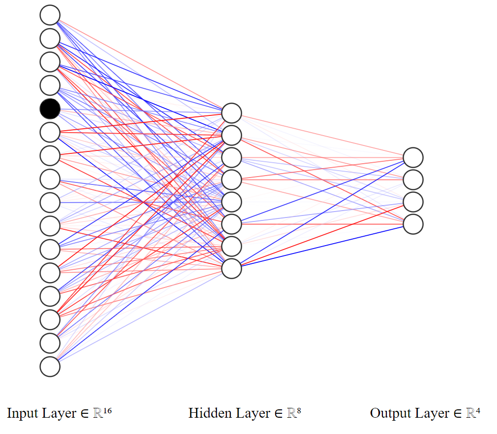

# quantum_reinforcement_learning

## Introduction

The concept of entropy is widely used in various machine learning methods. In this project we wanted to see, if this value behaves in the same way as an analogous quantity used in quantum physics - the entanglement entropy. To investigate this, we used both classical deep Q-learning and its quantum counterpart to train an agent to move in a simple Frozen Lake environment.

The output of a quantum circuit is of course a quantum state, for which the concept of entanglement entropy is pretty straightforward. In contrast, it's not as obvious in the case of classical RL. In that case, we were treating the output generated by the neural network as a quantum state (which in fact, is just some vector). 

## Classical method

### Reinforcement learning

Q-learning is a machine learning algorithm of the "Reinforcement Learning" type. The family of such algorithms differs from supervised and unsupervised learning in that the information for training is collected not from data, but from the interaction of the **agent** (trained algorithm) with the **environment**. The function that the agent is guided by is called **politics** and takes the **observation** as an input (e.g. the position of a player on the board, car speed on the track) and returns an **action** (e.g. move right, add gas).

Further reading: https://en.wikipedia.org/wiki/Reinforcement_learning

### Classical Q-Learning

We will explain the concept of Q-learning on the example of an agent moving around the "FrozenLake" environment. Let's take a 4x4 element board: 

```Python
import gym 

lake = gym.make('FrozenLake-v1', is_slippery=False)
lake.reset()
lake.render()
```

SFFF
FHFH
FFFH
HFFG

**Legend:**
- S: starting point, one per board,
- F: frozen surface - safe field,
- H: hole - an ice hole, a field that gives a large penalty, or ends the game,
- G: goal, end point.

The agent is always in one of the spaces and, based on his policy, decides to move in one direction (left, right, up, down). The entire walk focuses on the reward, which the agent increases or decreases by entering a specific field.
Scoring example:

- Safe field: -0.01 to the reward (penalty to eliminate detour or walking in circles),
- Starting point: -0.01 to reward,
- Drumbling: -1 to the reward,
- End point: +1 to the reward.

Politics is a Q function that takes an action (e.g. move left) and a state (field 5 - second row from the top, second column from the right) as an input, and returns an appropriate reward. In the the most basic case (without the use of deep learning), the update of the politics (after each step) is represented by the Bellman equation: 


Further reading: https://en.wikipedia.org/wiki/Q-learning


### Deep Q-Learning

However, in our case, we use the so-called Deep Q-Learning (DQL). To make decisions, we use a neural network with a 16-element input (number of fields on the board) and a 4-element output, corresponding to the weights provided for each movement:

- 0 - move left,
- 1 - move down,
- 2 - move right,
- 3 - move up.

For example, if we would like to check which way is the best to go from the field number 5, we activate the neuron with index 4 




We can access the exact values returned by the neural network as follows

```Python
agent.Qstate(4)
```
tensor([0.4165, 0.6063, 0.5308, 0.4209])


We can see, that the second element is the greatest in value, so the agent is going to move downwards.


### Implementation

The whole thing was coded in pytorch. The architecture of our model is a network consisting of linear layers, followed by a sigmoid activation function:
- https://pytorch.org/docs/stable/generated/torch.nn.Sigmoid.html
- https://pytorch.org/docs/stable/generated/torch.nn.Linear.html

The loss function used was the SmoothL1Loss: https://pytorch.org/docs/stable/generated/torch.nn.SmoothL1Loss.html

Several hundred epochs are enough to train a model. During the training we are tracking the percentage of cases, in which the walk ended up succesfully. For example, if the ratio of walks (over the last 50 epochs) during which the agent ended up in the goal field is equivalent to 90%, we are finishing the training process.


Below we present the average success rate over the last 50 epochs of training, during the total of 1000 epochs:

```Python
plt.figure(figsize=(12,5))
plt.plot(bin_stat.statistic)
plt.title(label=f'Percentage of succesfully finised walks (over the last {epoch_bin} epochs)')
plt.ylim(-1, 101)
plt.xlim(-1, (epochs+1)/epoch_bin)
plt.yticks(ticks=list(range(0, 110, 10)))
plt.xticks(ticks=bin_stat.bin_edges/epoch_bin-1, labels=bin_stat.bin_edges.astype(int))
plt.grid()
plt.show()
```


Additionally, we check whether the process is optimal or not. We strive for an algorithm that covers the route in 6 steps. If there is more of them, the algorithm is walking in circles. We are looking for the moment where it starts to oscillate around the optimal value. Therefore, we track how many steps an agent takes thanks to its politics, after each epoch: 


```Python
plt.figure(figsize=(12,5))
plt.plot(t.jList)
plt.yticks(ticks=list(range(0, 110, 10)))
plt.title(label="Number of states done by the agent")
plt.grid()
plt.show()
```


Let's check how a trained agent works: 


